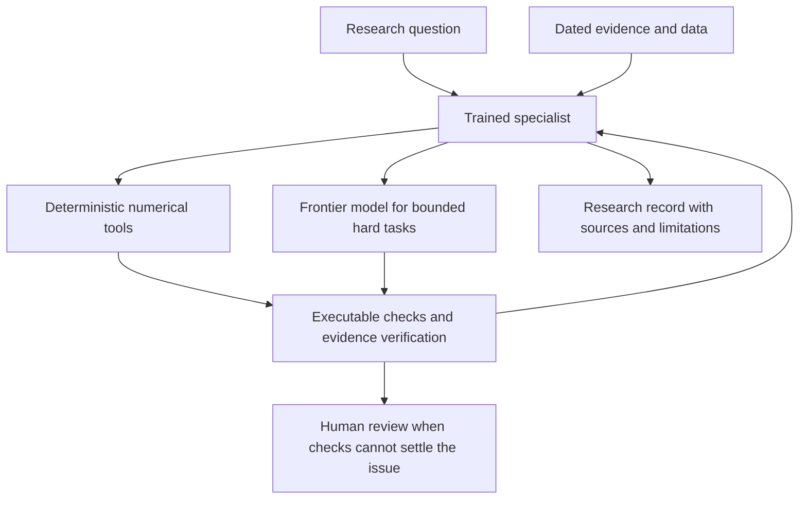

# Capstone: fixed income, then cross asset, then specialists

## Product target

A research model that understands the domain, completes intermediate quantitative work, and produces inspectable evidence. First cover rates and credit; then add equities, FX and commodities. Market facts stay in dated retrieval/data tools; stable domain concepts and recurring research skills can be learned in weights. No finite checkpoint can reliably contain all financial knowledge or all future market facts.

## Three configurations to compare

1. **Specialist only:** trained model plus the same retrieval and numerical tools; no frontier delegation.
2. **Frontier only:** a strong general model with the same evidence and tools.
3. **Specialist supervisor:** trained model owns the question, evidence, plan, task routing, acceptance checks, and final research record; frontier model performs difficult bounded subproblems.

Do not compare a tool-equipped specialist with a tool-free frontier model. Fix evidence and tool access, record compute and token budgets, and separately compare equal-budget and quality-target settings.

## Ownership must be measurable

The supervisor issues a task specification with inputs, units, as-of date, expected output schema and acceptance tests. It stores intermediate artifacts, rejects outputs that fail tests, requests correction, and preserves unresolved disagreements. Self-reported confidence or a second fluent explanation does not establish correctness. When the specialist lacks the competence to check a frontier result, require independent calculations, tests, or human review.

Measure injected-error detection, false rejection, correct escalation, unresolved-error rate, end-to-end task completion, latency, and cost. Test routing on task families absent from training. Never reward delegation avoidance when it increases error.

## Training sequence

**Fixed income v0:** select a small open-weight base only after evaluating licenses, hardware and baseline skills. Build a reviewed dataset of domain questions, numerical exercises, code tasks, tool-use examples, critique tasks, and relevance labels. Train a LoRA/QLoRA adapter, mixing in general quantitative tasks. Compare base, retrieval-only, and tuned variants.

**Cross asset v0:** continue with a balanced multi-task corpus covering common economic mechanisms and asset-specific conventions. Keep fixed-income retention tests. Record sampling proportions and evaluate per asset; an improved overall average cannot hide a damaged rates specialist.

**Distillation:** generate explicit answers, concise rationales, runnable code and tool records using permitted teacher outputs. Retain examples only after independent checks or expert review. Train rates and credit adapters/students first; preserve shared quantitative tasks. This is a separate training experiment, not merely different system prompts. Keep an untouched student test set, track teacher errors, and check model/provider terms before retaining training material.

## Domain and skill evaluations

Domain: instrument conventions, economic mechanisms, credit structure, scenario interpretation and uncertainty. Skills: data joins, temporal alignment, estimation, numerical optimization, statistical testing, code execution, debugging, and reproducibility. Initial targets are compact enough for review: roughly 100–200 evaluation tasks and hundreds of verified training examples, expanded only if observed learning curves justify it. Counts are planning targets, not established sufficiency.

## Proposed promotion gates

Pre-register thresholds before training. Promote only if the tuned model improves its primary held-out task metric with uncertainty reported, has no unresolved critical unit/leakage errors, and retains general skills within the pre-agreed tolerance. A small noisy sample may yield an inconclusive result. Publish that result honestly.

The supervisor configuration is the initial engineering candidate, not a predetermined winner. Use results to decide when the standalone specialist is good enough, and which tasks continue to need delegation.

## Resource decisions still needed

Hardware/GPU access, a weekly API ceiling, a total training ceiling, and permitted datasets. Default now: local CPU experiments, no paid inference or training. Plan small runs before scaling; do not provision a large training job merely to match an institutional paper.
